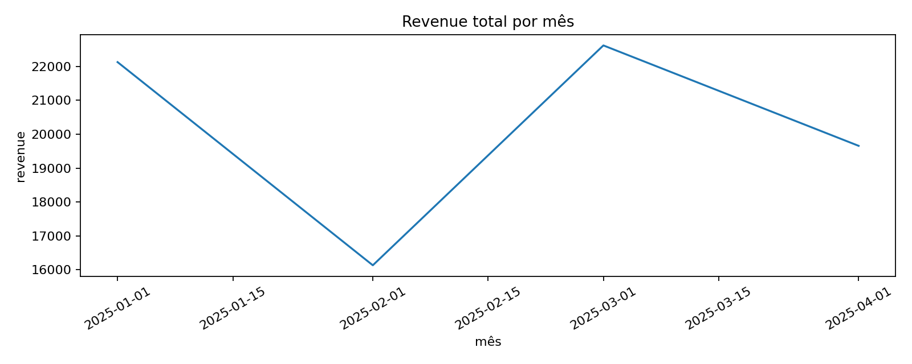
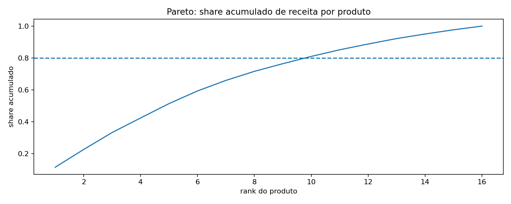
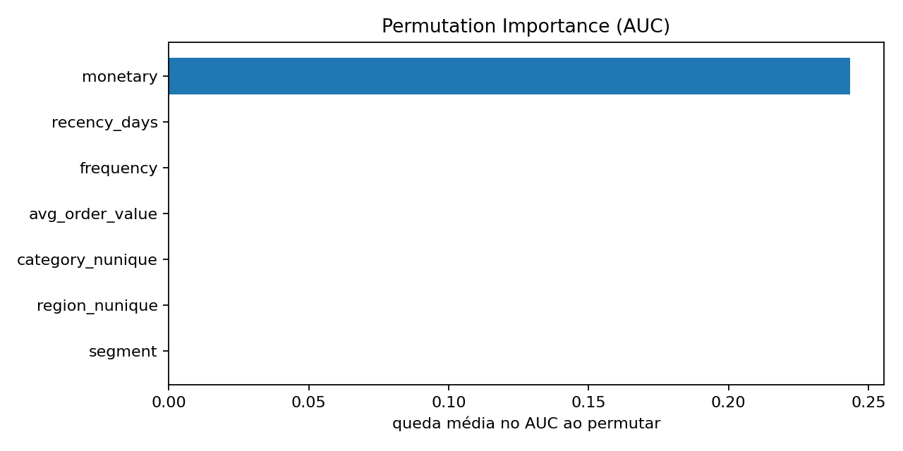

# Projeto Final — EDA + RFM + ML (VIP de Clientes)


Este projeto foi criado para **portfólio**: fluxo end-to-end (dados → EDA → features → modelo → resultados).


## Objetivo
Entregar um projeto completo (dados → EDA → features → modelo → evidências), pronto para GitHub/LinkedIn.

## Dataset
- `dados/sample/sales.csv`
- `dados/sample/customers.csv`

(Você pode trocar pelo repo de bases em `dados/source/`.)

## Como rodar
Na raiz do repositório:

```bash
python -m venv .venv
# Windows: .venv\Scripts\activate
# Linux/Mac: source .venv/bin/activate
pip install -r requirements.txt
```

Rodar o projeto via notebook:
- [`projects/99_projeto_final_end_to_end/01_projeto_final_vip_rfm.ipynb`](01_projeto_final_vip_rfm.ipynb)

Ou via scripts (gera features e artefatos):

```bash
python scripts/07_eda_avancado/03_feature_engineering_rfm_parquet.py
python scripts/08_machine_learning/03_pipeline_comparacao_modelos.py
python scripts/08_machine_learning/04_tuning_interpretabilidade.py
```

## Perguntas de negócio
- Quem são os clientes que mais contribuem para a receita (Pareto 80/20)?
- Quais produtos/categorias concentram vendas?
- Qual o perfil do cliente VIP (frequência, recência, ticket)?

## Entregáveis (portfólio)
- Notebook final com narrativa e decisões
- Imagens e evidências em `assets/`
- Artefatos do pipeline em `dados/output/` e `dados/output/ml/`

## Evidências (para portfólio)
As imagens abaixo são geradas pelos scripts ou pelo notebook do projeto:

### EDA mensal


### Pareto de produtos


### Importância de variáveis



## Checklist de entrega
- [ ] Notebook final com resumo executivo (5–8 linhas)
- [ ] 3 evidências no README (imagens)
- [ ] Métricas e comparação de modelos em `dados/output/ml/`
- [ ] Próximos passos bem definidos

## Próximos passos (para deixar mais “real”)
- Trocar o alvo “VIP” por um alvo de negócio (ex.: churn, upsell, inadimplência)
- Adicionar validações de qualidade (regras e alertas)
- Criar um dashboard simples (Power BI) consumindo `dados/processed/rfm_features.parquet`

## Créditos
Este projeto faz parte da mentoria **Python para Dados**.
